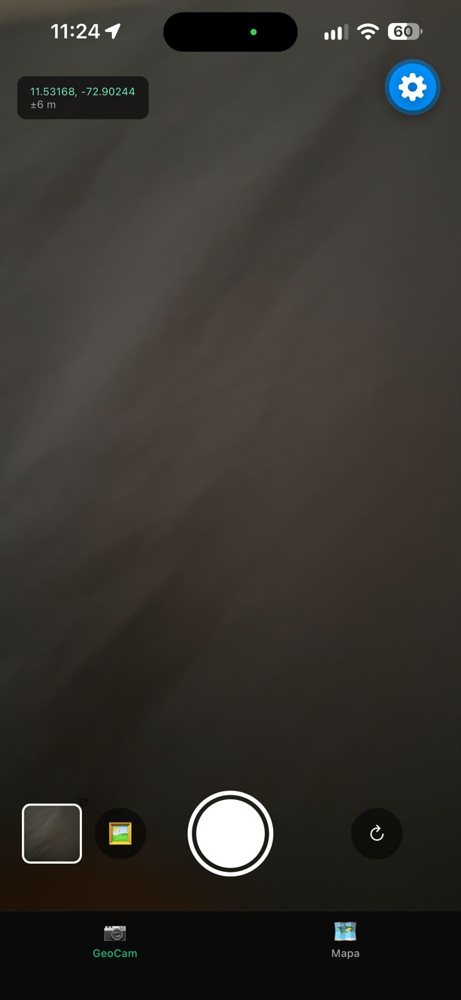
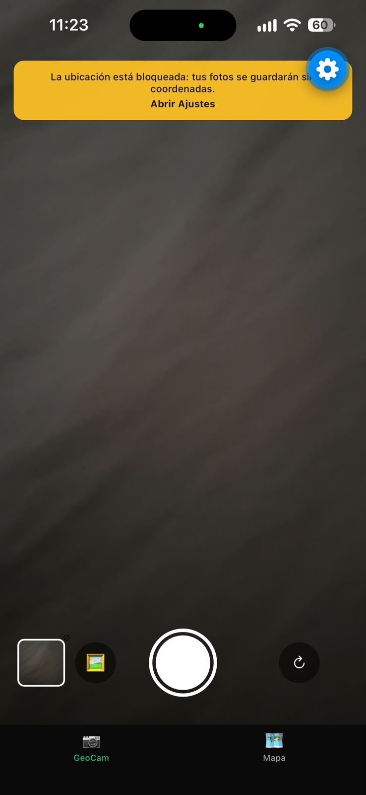
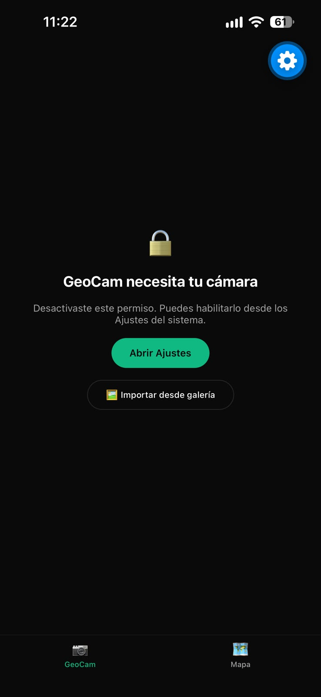

# GeoCam 📷📍

Cámara que etiqueta cada foto con coordenadas GPS y reacciona al movimiento del teléfono.
Taller Integrador 2 · **Semana 6: Módulos Nativos y Sensores del Dispositivo**.

Construida con **Expo SDK 57**, Expo Router y TypeScript estricto. Todo el acceso al hardware
está encapsulado en Custom Hooks tipados (sin `any`) que exponen los errores como estado para la UI.

## Funcionalidades

| Requisito | Implementación |
| --- | --- |
| Cámara con permisos | `hooks/useCamera.ts` + `components/PermissionPrimer.tsx` |
| Ubicación con permisos y seguimiento | `hooks/useGeoLocation.ts` |
| R1. Estado global de fotos | `context/GeoPhotosContext.tsx` (`addPhoto`, `removePhoto`, `clearAll`, inmutable) |
| R2. Importar desde galería | `lib/photos.ts` → `launchImageLibraryAsync({ mediaTypes: ['images'] })`, `source: 'gallery'` (borde morado) |
| R3. Pestaña Mapa | `app/(tabs)/mapa.tsx`: un `Marker` por foto, miniatura al tocar, lista "Sin ubicación" |
| R4. Agitar para borrar | `hooks/useShake.ts` → `Alert` de confirmación |
| Reto: ubicación aproximada | `useGeoLocation().isApproximate` (precisión > 1 km) muestra aviso |

## Estructura

```
app/_layout.tsx
app/index.tsx               → redirige a /geocam
app/(tabs)/_layout.tsx      → Tabs + GeoPhotosProvider
app/(tabs)/geocam.tsx
app/(tabs)/mapa.tsx
components/PermissionPrimer.tsx
components/StatusBanner.tsx
constants/theme.ts
context/GeoPhotosContext.tsx
hooks/useCamera.ts
hooks/useGeoLocation.ts
hooks/useShake.ts
lib/permissions.ts          → mapPermission(): respuesta de Expo → PermissionState
lib/photos.ts
types/geo.ts
```

## Máquina de estados de permisos

```
checking -> undetermined -> (acepta) -> granted
                         -> (rechaza) -> denied -> (rechaza de nuevo) -> blocked
blocked -> Linking.openSettings() -> (lo activa en Ajustes) -> granted
```

`lib/permissions.ts` traduce `{ status, granted, canAskAgain }` a `PermissionState`.
Cuando `canAskAgain === false` el estado es `blocked` y la UI muestra **"Abrir Ajustes"**.
Al volver a la app (`AppState` → `active`) los hooks vuelven a *consultar* (no pedir) el permiso,
de modo que si el usuario lo activó en Ajustes la pantalla pasa sola a `granted`.

## Capturas de los tres estados de permiso

| Concedido | Rechazado | Bloqueado |
| :---: | :---: | :---: |
|  |  |  |
| Cámara activa con coordenadas en vivo | Pantalla previa con "Permitir acceso" / banner "Sin ubicación" | Botón **"Abrir Ajustes"** |

> Las capturas se toman en un teléfono físico (ver [docs/screenshots/README.md](docs/screenshots/README.md)).

## Checklist de entrega

- [x] **Permisos en contexto, nunca al abrir.** Al montar, los hooks solo llaman a
  `getForegroundPermissionsAsync` / `useCameraPermissions` (consulta). El diálogo del sistema
  aparece solo al tocar "Permitir acceso" o el banner de ubicación.
- [x] **Si niegas la ubicación, la cámara sigue funcionando** y un banner lo comunica;
  la foto se guarda con `coords: null` y aparece en "Sin ubicación" en el Mapa.
- [x] **Botón "Abrir Ajustes"** en `PermissionPrimer` (cámara) y en el banner (ubicación) cuando
  el estado es `blocked`.
- [x] **Todas las suscripciones se limpian al salir de la pantalla.** Las pestañas no se desmontan,
  así que las pantallas pasan `useIsFocused()` como `enabled` a `useGeoLocation` y `useShake`;
  al perder el foco el efecto hace `subscription.remove()` (con bandera `cancelled` contra la
  condición de carrera) y la `CameraView` se desmonta. En desarrollo se registra
  `[useGeoLocation] cleanup: GPS detenido` y `[useShake] cleanup: acelerómetro detenido`.
- [x] **Hooks tipados, sin `any`** (`@typescript-eslint/no-explicit-any: error`), con `error: string | null`
  en el estado que retorna cada hook.

## Ejecutar

```bash
npm install
npx expo start          # escanea el QR con Expo Go (teléfono físico)
# o, si el teléfono no está en la misma red:
npx expo start --tunnel
```

Verificaciones:

```bash
npx tsc --noEmit
npx expo lint
```

Para instalar módulos nuevos usa siempre `npx expo install <paquete>` (no `npm install`).

### Cómo probar cada estado

1. **Concedido:** abre GeoCam → "Permitir acceso" → acepta. Toca el banner amarillo → acepta la ubicación.
2. **Rechazado:** borra los datos de Expo Go (o reinstala) y rechaza el diálogo una vez.
3. **Bloqueado:** en Android, rechaza la cámara dos veces; en iOS basta un rechazo.
   Aparece "Abrir Ajustes"; actívalo allí y vuelve: la cámara se abre sola.
4. **Limpieza:** con la consola de Metro abierta, cambia a la pestaña Mapa y verifica el log de cleanup.
5. **Shake:** agita el teléfono con fotos guardadas → confirma el borrado.

## Notas

- En Expo Go se ven los textos de permiso genéricos de Expo Go; los de `app.json` solo aparecen en builds propios.
- Solo se pide ubicación en **primer plano** (`requestForegroundPermissionsAsync`).
- Escribir coordenadas en el EXIF requiere módulos fuera de Expo Go; por eso cada foto es un objeto
  `GeoPhoto` en memoria (base del esquema SQLite de la Semana 7).
- En producción, `react-native-maps` en Android necesita una API key de Google Maps.
